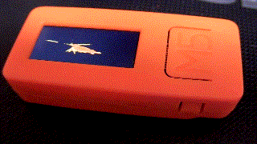
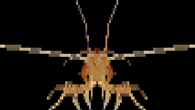
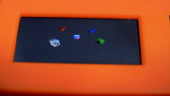
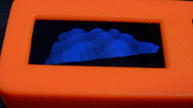
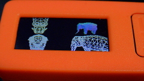
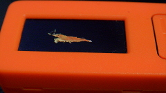

## 3d-software-renderer m5stickc/m5stack/console-app/windows-app/ncurses/emscripten  
- 複数のウィンドウ  
- ワイヤーフレーム、ポリゴン、法線カラー、半透明、テクスチャ  
- テクスチャパース補正  
- Directional Light  
- Ambient  
- テクスチャなしなら8000ポリゴンくらいまで(m5stickc)  
- コンソール、ウィンドウアプリ化できる  

  
  

  
example1  
  
example2  
  
example3  
  
example4  
  
vert:1183, face:2208, vertuv:1183, faceuv:2208,texture:64x32  

<https://ebicochineal.github.io/E512W3D/emscripten-e512w3d-example4/>  

---

Blender 3Dファイルエクスポート設定 
```
objファイル
[+] Triangulate Faces
[-] Write Normals
[-] Write Materials
```
objファイルをスクリプトでhppに変換  
pngファイルをスクリプトでhppに変換  

---
## M5StickC
M5StickC以外ではテストしていませんが他のボードでも動くかもしれません  
- M5StickCPlus
- M5Stack
- M5Stack-Fire
- M5Stack-Core2

Arduino IDE設定  
```
ファイル/環境設定/追加のボードマネージャのURL
https://dl.espressif.com/dl/package_esp32_index.json

ツール/ボード/ボードマネージャ
esp32 by Espressif System インストール

ツール/ライブラリを管理
M5StickC インストール
// M5StickCPlus, M5Stack インストール
```

Arduino IDEで書き込み  

---
## console-app
.ino -> .cpp  

mingw, gcc  
windowsのコマンドプロンプトだとカラー表示できないためlinuxかwsl  
ncurses導入済みでこっちを使う場合はE512W3DUtilsXの#define USENCURSESをコメントアウト  
```
g++ -std=c++1z ***.cpp -o ***.out
```
---
## ncurses
.ino -> .cpp  

mingw, gcc  
ncursesインストール  
```
sudo apt-get install ncurses-dev
```

```
g++ -std=c++1z ***.cpp -o ***.out -lncurses
```
Escで終了  
Escで終了しないと色がおかしくなる  
color_content, pair_contentで色情報保存して最後に戻しているつもり  


---
## windows-app
.ino -> .cpp  
windows mingw  
```
g++ -std=c++1z -static-libstdc++ -static -lstdc++ -mwindows ***.cpp -o ***.exe
```

---
## emscripten
.ino -> .cpp  
```
em++ ./***.cpp -o ./e512w3d.js -s ASYNCIFY
```
index.html
```html
<!DOCTYPE html>
<html lang="ja">
    <head>
        <meta charset="utf-8">
        <meta name="description" content="emscripten-e512w3d">
        <title>emscripten-e512w3d</title>
        <script src="e512w3d.js"></script>
        <script>
            function CanvasStyleResize () {
                e512w3d_canvas = document.getElementById('e512w3d-canvas');
                e512w3d_ctx = e512w3d_canvas.getContext('2d');
                e512w3d_canvas.style.width = document.documentElement.clientWidth + "px";
                e512w3d_canvas.style.height = document.documentElement.clientWidth/2 + "px";
                e512w3d_canvas.style.imageRendering = "pixelated";
            }
            window.onresize = CanvasStyleResize;
            window.onload = CanvasStyleResize;
        </script>
    </head>
    <body style="margin:0">
        <canvas id="e512w3d-canvas"></canvas>
    </body>
</html>
```
```
py -m http.server 8000
```
```
http://localhost:8000/
```

---

#### キー入力, マウス入力  

bool keydown (char c)  
int cursor_x  
int cursor_y  
bool cursor_l  
bool cursor_m  
bool cursor_r  

or  

#### E512W3DInput  
|  | m5stickc | console | ncurses | windows | emscripten |  
| -              | - | - | - | - | - |  
| getKey         | no      | no      | yes     | yes      | yes      |  
| getKeyUp       | no      | no      | no      | yes      | yes      |  
| getKeyDown     | no      | no      | no      | yes      | yes      |  
| getButton      | partial | no      | no      | yes      | yes      |  
| getButtonUp    | partial | no      | no      | yes      | yes      |  
| getButtonDown  | partial | no      | no      | yes      | yes      |  
| cursorPosition | partial | no      | no      | yes      | yes      |  

```cpp
void loop() {
    if (e512w3d.isFixedTime()) {
        E512W3DInput::update();
        if (E512W3DInput::getButtonDown(0)) { /**/ }
    }
}
```


m5stickc  
M5.updateはE512W3DInput::updateで呼ばれます  
getButtonはBtnA=0, BtnB=1のみ使えます  
M5.Lcd.setRotation(1)で画面を上にした状態を初期状態とし、カーソルは加速度センサーで動かしています  

カーソル位置の確認
```cpp
void loop () {
    if (e512w3d.isFixedTime()) {
        E512W3DInput::update();
        e512w3d.clear();
        w.begin();
        w.drawLine(0, c.y, e512w3d.width-1, c.y, color565(255, 255, 255));
        w.drawLine(c.x, 0, c.x, e512w3d.height-1, color565(255, 255, 255));
        e512w3d.pushScreen();
    }
}
```
---

#### E512W3DInput
static void update ()  
static bool getKey (uint8_t c)  
static bool getKeyUp (uint8_t c)  
static bool getKeyDown (uint8_t c)  
static bool getButton (uint8_t c)  
static bool getButtonUp (uint8_t c)  
static bool getButtonDown (uint8_t c)  
static Vector2 cursorPosition ()  


E512Array<uint8_t> numtostr (int v)  
E512Array<uint8_t> numtostr (float v, uint8_t n = 4)  
uint16_t color565 (uint16_t r, uint16_t g, uint16_t b)  


#### E512Array
uint32_t size ()  
uint32_t capacity ()  
void shrink_to_fit ()  
void reserve (uint32_t sz)  
void resize (uint32_t sz, T c = T())  
void emplace_back (T t)  
void push_back (T t)  
void pop_back (T t)  
void erase_index (int index)  
void erase_value (T t)  
void clear ()  
T& front ()  
T& back ()  

#### E512W3DWindowManager
E512W3DWindowManager ()  
void begin ()  
void add (E512W3DWindow& w)  
void draw ()  
void fixedDraw ()  
void fixedDrawWait ()  
bool isFixedTime ()  
void pushScreen ()  
uint16_t fixed_milli_time = 33  
void clear ()  
#### E512W3DWindow  
E512W3DWindow ()  
E512W3DWindow (uint16_t bgcolor)  
E512W3DWindow (int16_t sx, int16_t sy, uint16_t width, uint16_t height)  
E512W3DWindow (int16_t sx, int16_t sy, uint16_t width, uint16_t height, uint16_t bgcolor)  
E512W3DWindow (int16_t sx, int16_t sy, uint16_t width, uint16_t height, uint16_t bgcolor, Vector3 light)  
void resize (uint16_t width, uint16_t height)  
void setDirectionalLight (float x, float y, float z)  
void setDirectionalLight(Vector3(x, y, z))  
void addChild (Object3D& o)  
void setCamera (Object3D& o)  
int16_t sx = 0  
int16_t sy = 0  
uint16_t width  
uint16_t height  
uint16_t bgcolor  
float ambient = 0 // 0f - 1f  
float light_strength = 1.0f;  
bool isortho = false
float ortho_size = 0.1f
void draw ()  
void draw (Object3D& obj, bool child = false)  
void drawObjestAxis (Object3D& obj)  
void drawLine (Object3D& start, Object3D& end, uint16_t color = 0xFFFF)  
void drawLine (Vector3 start, Vector3 end, uint16_t color = 0xFFFF)  
void drawLine (uint16_t sx, uint16_t sy, uint16_t ex, uint16_t ey, uint16_t color = 0xFFFF)  
void drawPoint (Object3D& obj, uint16_t size = 1, uint16_t color = 0xFFFF)  
void drawPoint (Vector3 p, uint16_t size = 1, uint16_t color = 0xFFFF)  
void drawPoint (int16_t px, int16_t py, uint16_t size = 1, uint16_t color = 0xFFFF)  
void begin (bool color_buffer_clear = true, bool z_buffer_clear = true)  
Vector3 screenPosition (Object3D& obj)  
Vector3 screenPosition (Vector3 p)  
  
uint16_t text_color;  
uint16_t text_bgcolor;  
bool text_use_bgcolor;  
void setTextCursor (int16_t x, int16_t y)  
void setTextSize (uint16_t n)  
void print (E512Array<uint8_t> v, bool wordwrap = true)  
void println (E512Array<uint8_t> v, bool wordwrap = true)  
void print (const char* cp, bool wordwrap = true)  
void println (const char* cp, bool wordwrap = true)  
void print (const uint8_t c, bool wordwrap = true)  
void println (const uint8_t c, bool wordwrap = true)  
Matrix4x4 view
Matrix4x4 projescreen

  
#### Object3D  
Vector3 position  
Quaternion rotation  
Vector3 scale  
Mesh* mesh  
Object3D* parent  
uint16_t render_type = RenderType::WireFrame  
E512Array<Object3D*> child  
void setParent (Object3D& o)  
void addChild (Object3D& o)  
Matrix4x4 worldMatrix ()  
Vector3 worldPosition ()  
Vector3 forward ()  
Vector3 back ()  
Vector3 up ()  
Vector3 down ()  
Vector3 right ()  
Vector3 left ()  
RaycastHit raycast (Ray r)  

#### Ray
Vector3 position  
Vector3 direction  
float distance  
Ray ()  
Ray (Vector3 s, Vector3 e)  
Ray (int x, int y, Matrix4x4 view, Matrix4x4 proj)  
float raytriangle (Vector3 v1, Vector3 v2, Vector3 v3)
float raytriangle (Vector3 v1, Vector3 v2, Vector3 v3, float& u, float& v)
#### RaycastHit
Vector3 point  
float u, v, distance  
uint32_t triangleindex  
    
#### Mesh
void addVertex (float x, float y, float z)  
void addVertex (Vector3 v)  
void addFace (uint16_t a, uint16_t b, uint16_t c)  
void addFace (Face f)  
void addVertexUV (float x, float y)  
void addVertexUV (Vector2 v)  
void addFaceUV (uint16_t a, uint16_t b, uint16_t c)  
void addFaceUV (Face f)  
#### Face
uint16_t a, b, c  

#### Quaternion
static Quaternion angleAxis (float w, float x, float y, float z)  
static Quaternion angleAxis (float w, Vector3 v)  

#### enum RenderType
WireFrame  
PolygonColor  
PolygonNormal  
PolygonTranslucent  
PolygonTexture  
PolygonTextureDoubleFace  
PolygonTexturePerspectiveCorrect  
PolygonTexturePerspectiveCorrectDoubleFace  
Hide  
None  
