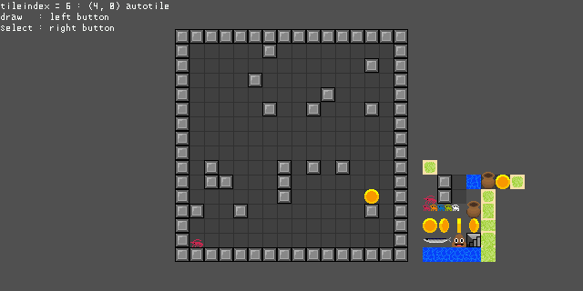

## 3d-software-rendering m5stickc/m5stack/console-app/windows-app/ncurses/emscripten/android/raspberry-pi-pico/raspberry-pi-pico2  
- C++で3Dモデルの表示やゲームなどを作成できます  
- ソフトウェアレンダリングなのでマイコンボードなどでも動作します  
- 複数のウィンドウ  
- ワイヤーフレーム、ポリゴン、法線カラー、半透明、テクスチャ  
- テクスチャパース補正  
- Directional Light  
- Ambient  
- テクスチャなしなら8000ポリゴンくらいまで(m5stickc)  
- emscriptenを使用すればWebブラウザで動作させることもできます
- シングルコアで動作します。2コアで動作する[バージョン](https://github.com/ebicochineal/E512W3D/tree/master/multicore)もあります  
- タイルマップなど2Dゲームを作成するための機能  
- [multicore](https://github.com/ebicochineal/E512W3D/tree/master/multicore)  
- [gui](https://github.com/ebicochineal/E512W3D/tree/master/gui)  
- [tilemap](https://github.com/ebicochineal/E512W3D/tree/master/tilemap)  

---


- [M5StickC](#M5StickC)
- [console-app](#console)
- [ncurses](#ncurses)
- [windows-app](#windows)
- [emscripten](#emscripten)
- [android](#android)
- [raspberry-pi-pico](#raspberrypipico)

---

#### examples

Arduino以外の環境ではexampleの拡張子を.inoから.cppにしてください  
Arduino以外の環境でもsetup関数が最初に呼ばれ、loop関数を繰り返し実行されます  

  
  

  
example1  
  
example2  
  
example3  
  
example4  
  
vert:1183, face:2208, vertuv:1183, faceuv:2208,texture:64x32  

example4  
<https://ebicochineal.github.io/E512W3D/emscripten-e512w3d-example4/>  


exampletm  
  
<https://ebicochineal.github.io/E512W3D/emscripten-e512w3d-exampletm/>  


---

#### Blender 3Dファイルエクスポート設定 
```
objファイル
[+] Triangulate Faces
[-] Write Normals
[-] Write Materials
```
objファイルをスクリプトでhppに変換  
pngファイルをスクリプトでhppに変換  

---
<a id="M5StickC"></a>
## M5StickC

arduino ide  
M5StickC以外ではテストしていませんが他のボードでも動くかもしれません  
- M5StickCPlus
- M5Stack
- M5Stack-Fire
- M5Stack-Core2

Arduino IDE設定  
```
ファイル/環境設定/追加のボードマネージャのURL
https://dl.espressif.com/dl/package_esp32_index.json

ツール/ボード/ボードマネージャ
esp32 by Espressif System インストール

ツール/ライブラリを管理
M5StickC インストール
// M5StickCPlus, M5Stack インストール
```

Arduino IDEで書き込み  

---


<a id="console"></a>

## console-app


gcc  
ncurses導入済みでこっちを使う場合はE512W3DUtilsXの#define USENCURSESをコメントアウト  
```
g++ -std=c++1z ***.cpp -o ***.out
```
---
<a id="ncurses"></a>
## ncurses
gcc, ncurses  
ncursesインストール  
```
sudo apt-get install ncurses-dev
```

```
g++ -std=c++1z ***.cpp -o ***.out -lncurses
```

---
<a id="windows"></a>
## windows-app
mingw  
```
g++ -std=c++1z -static-libstdc++ -static -lstdc++ -mwindows ***.cpp -o ***.exe
```

---
<a id="emscripten"></a>
## emscripten
emscripten  
```
em++ ./***.cpp -o ./e512w3d.js -s ASYNCIFY
```
e512w3d.jsとe512w3d.wasmが作成されるかと思います  
以下のindex.htmlをテキストエディタなどで作成し  
pythonなどでローカルwebサーバを立ち上げwebブラウザでアクセスしてください  
index.html
```html
<!DOCTYPE html>
<html lang="ja">
    <head>
        <meta charset="utf-8">
        <meta name="description" content="emscripten-e512w3d">
        <title>emscripten-e512w3d</title>
        <script src="e512w3d.js"></script>
        <script>
            function CanvasStyleResize () {
                e512w3d_canvas = document.getElementById('e512w3d-canvas');
                e512w3d_ctx = e512w3d_canvas.getContext('2d');
                e512w3d_canvas.style.width = document.documentElement.clientWidth + "px";
                e512w3d_canvas.style.height = document.documentElement.clientWidth/2 + "px";
                e512w3d_canvas.style.imageRendering = "pixelated";
            }
            window.onresize = CanvasStyleResize;
            window.onload = CanvasStyleResize;
        </script>
    </head>
    <body style="margin:0">
        <canvas id="e512w3d-canvas"></canvas>
    </body>
</html>
```

```
py -m http.server 8000
```
```
http://localhost:8000/
```
---

<a id="android"></a>

## android
Visual Studio 2019  
Visual Studio 2019インストール デスクトップとモバイル C++によるモバイル開発  
- テンプレート Native-Activity  
- ソリューションのプラットフォームを切り替えるARM64など

- プロジェクトのプロパティ リンカー コマンドライン 追加のオプション -lm  
  
- 画面の回転を横に固定する AndroidManifest.xml activityタグにandroid:screenOrientation="landscape"を追加  

- main.cpp削除
- E512W3Dのファイルを追加 ソリューション名/プロジェクト名/プロジェクト名.NativeActivity/ E512W3D.hpp, E512W3DUtils.hpp, E512W3DUtilsX.hpp, E512W3DWindow.hpp, ***.cpp
- プロジェクト名.NativeActivity 追加 既存の項目で先ほどのファイルを追加


---
<a id="raspberrypipico"></a>
## raspberry-pi-pico / raspberry-pi-pico2
ArduinoIDEでpico1, 2どちらでも動作します  
ST7735を搭載した解像度160x80ディスプレイを使用します  
必要に応じて変更すれば他のディスプレイを使うことができるかもしれませんE512W3DUtilsX.cppの16~115行のコードを変更してください  
ライブラリにバグがあるらしく青と赤が反転しているためE512W3DUtilsX.cppの100行目からの処理で再び反転させています  
色が反転する場合はコメントアウトしてください  

ボードマネージャで追加してください  
どちらでも動作します  
```
Arduino Mbed OS RP2040 Boards
Raspberry Pi Pico/RP2040 (earlephilhower)
```
オーバークロックする場合はearlephilhower版で簡単にできます  
300Mhzでは動作しませんでした250Mhzでは動作しました  

<!-- 
|display |pico  |
|-       |-     |
|GND     |GND   |
|VCC     |3.3V  |
|SCK     |GPIO18|
|SDA     |GPIO19|
|RES     |GPIO22|
|DC      |GPIO28|
|CS      |GPIO17|
-->

|pin    |      |      |      |      |      |      |      |
|-      |-     |-     |-     |-     |-     |-     |-     |
|pico   |GND   |3.3V  |GPIO18|GPIO19|GPIO22|GPIO28|GPIO17|
|display|GND   |VCC   |SCK   |SDA   |RES   |DC    |CS    |
  
ライブラリマネージャで追加してください  
```
Adafruit_GFX  
Adafruit_ST7735  
```


---

## キー入力, マウス入力  

bool keydown (char c)  
int cursor_x  
int cursor_y  
bool cursor_l  
bool cursor_m  
bool cursor_r  

or  

E512W3DInput  
|                | m5stickc | console | ncurses | windows | emscripten | android | pico |
| -              | -        | -       | -       | -       | -          | -       | -    |
| getKey         | no       | no      | yes     | yes     | yes        | no      | no   |
| getKeyUp       | no       | no      | no      | yes     | yes        | no      | no   |
| getKeyDown     | no       | no      | no      | yes     | yes        | no      | no   |
| getButton      | partial  | no      | no      | yes     | yes        | partial | no   |
| getButtonUp    | partial  | no      | no      | yes     | yes        | partial | no   |
| getButtonDown  | partial  | no      | no      | yes     | yes        | partial | no   |
| cursorPosition | partial  | no      | no      | yes     | yes        | yes     | no   |

```cpp
void loop() {
    if (e512w3d.isFixedTime()) {
        E512W3DInput::update();
        if (E512W3DInput::getButtonDown(0)) { /**/ }
    }
}
```


#### m5stickc  
M5.updateはE512W3DInput::updateで呼ばれます  
getButtonはBtnA=0, BtnB=1のみ使えます  
M5.Lcd.setRotation(1)で画面を上にした状態を初期状態とし、カーソルは加速度センサーで動かしています  

m5stickcでのカーソル位置の確認
```cpp
void loop () {
    if (e512w3d.isFixedTime()) {
        // E512W3DInput::width = e512w3d.width;
        // E512W3DInput::height = e512w3d.height;
        E512W3DInput::update();
        e512w3d.clear();
        w.begin();
        Vector2 c = E512W3DInput::cursorPosition();
        w.drawLine(0, c.y, e512w3d.width-1, c.y, color565(255, 255, 255));
        w.drawLine(c.x, 0, c.x, e512w3d.height-1, color565(255, 255, 255));
        e512w3d.pushScreen();
    }
}
```
---
## Draw

- Drawにはスクリーン全体、ウィンドウ全体、オブジェクトごとの3種類があります  
- e512w3dのDraw系メソッドはどれもスクリーン全体描画で次のフレームまで処理を止めるか、すぐに描画するかなどがあります  
- windowのdrawメソッドはオブジェクトを指定しなければwindow全体となります  
オブジェクトを指定のdrawであれば同じオブジェクトを位置をずらして描画したりすることができdrawLineやテキストの表示などもできます  
  - 始めにe512w3d.clearしてください  
  - オブジェクトごとのdrawならw.beginもしてください  
  - 最後にpushScreenしてください  


```cpp
E512W3DWindow w;
Object3D a;

void loop () {
    //
    e512w3d.draw();
}

void loop () {
    //
    e512w3d.fixedDrawWait();
}

void loop () {
    //
    e512w3d.fixedDraw();
}

void loop () {
    //
    e512w3d.fixedWait();
    e512w3d.draw();
}

void loop () {
    //
    e512w3d.fixedWait();
    e512w3d.clear();
    w.draw();
    e512w3d.pushScreen();
}

void loop () {
    //
    e512w3d.fixedWait();
    e512w3d.clear();
    w.begin();
    w.draw(a);
    w.println("text");
    e512w3d.pushScreen();
}

void loop () {
    //
    if (e512w3d.isFixedTime()) {
        e512w3d.draw();
    }
}

void loop () {
    //
    if (e512w3d.isFixedTime()) {
        //
        e512w3d.clear();
        w.draw();
        e512w3d.pushScreen();
    }
}

void loop () {
    //
    if (e512w3d.isFixedTime()) {
        //
        e512w3d.clear();
        w.begin();
        w.draw(a);
        w.println("text");
        e512w3d.pushScreen();
    }
}
```

---
## E512Array
Arduino環境では可変長配列が無かったため可変長配列を作りました  
std::vectorと大体同じように使えるかと思います  
クラスや構造体は引数無しコンストラクタが無い場合エラーになります  

可変長配列とポインタ  
E512W3DWindowはdrawメソッドで登録したオブジェクトを描画するためにObject3D\*型の変数を持っています  
```cpp
E512W3DWindow w;
E512Array<Object3D> objs;
void setup () {
    ...
    Object3D o;
    // meshなど設定
    objs.emplace_back(o);
    w.addChild(objs[0]);
    ...
}
```
この場合動作しますが  
addChildのあとにobjsに追加すると  
配列の再確保によりwに保存されているObject3D\*がobjs[0]を示さなくなりエラーになります  
そのためobjsはE512Array<Object3D\*>で作った方が良いです  
```cpp
E512W3DWindow w;
E512Array<Object3D*> objs;
void setup () {
    ...
    Object3D* o = new Object3D();
    // meshなど設定
    objs.emplace_back(o);
    w.addChild(*objs[0]);
    ...
}
```
このようにすれば配列が再確保されたとしても動作します  

---
## 文字出力
e512w3dのdrawメソッドで画面全体の描画を行わないのであれば文字の出力ができます  
出力できるのはchar, const char[], E512Array<uint8_t>です  
表示用の文字列はstd::stringなどを使用せずE512Array<uint8_t>を使ってください  
```cpp
E512Array<uint8_t> str = cptou8a("hello world");
```

drawCharメソッドで任意の位置に文字を出力できます  
#### printメソッド  
- 文字列出力を行えます  
- printlnメソッドで文字列の出力と改行を行えます  
- wordwrapを指定することで折り返しの制御を行えます  
- 位置を指定するにはsetTextCursorメソッドを使用してください  

フォントは幅6高さ12ピクセルの物を用意しています  
サイズは2倍3倍などの拡大も可能です  
atok関数で日本式ローマ字文字列を半角カタカナ文字列に変換することができますが、そこそこ重いので毎フレーム同じ文字列を変換して表示するのは避けた方が良いです  
```cpp
void loop () {
    if (e512w3d.isFixedTime()) {
        e512w3d.clear();
        w.begin();
        w.draw();// window 3d object draw
        w.println("text");
        w.println(atok("haro-wa-rudo"));
        w.println(numtostr(1234));
        w.println(1234);
        w.println(0.1234);
        e512w3d.pushScreen();
    }
}
```

画面上のオブジェクトの位置にテキストを表示したい場合はscreenPositionで座標を取得できます  
```cpp
Vector3 p = w.screenPosition(a);
w.setTextCursor(p.x, p.y);
w.print("text");
```
printメソッドで背景色を使用するにはtext_use_bgcolorをtrueにしてください  
```cpp
w.text_use_bgcolor = true;
w.text_bgcolor = color565(255,0,0);
```
---
## RayCast
Rayを作成しオブジェクトとのRay判定ができます  

- スクリーン座標からのRayの作成  
```Ray (int x, int y, Matrix4x4 view, Matrix4x4 proj)```  
- 座標sから座標eへのRayの作成  
```Ray (Vector3 s, Vector3 e)```  
- オブジェクトとのHit判定  
```RaycastHit hit = obj.raycast(ray)```  
- RaycastHit構造体
  - hit.distance Hitした距離 Hitしなかった場合は-1
  - hit.u, hit.v テクスチャUV座標
  - hit.point RayがHitしたワールド座標
  - hit.triangleindex Meshのfacesのインデックス


#### ３Dペイント例  
example4のloop関数を書き換えます  
動作確認する際はカーソルの移動が可能なwindows-app, emscripten, M5StickCなどで実行してください  
このモデルはテクスチャの一部を複数のポリゴンと共有しているため右を塗ると左のテクスチャも変わります  
テクスチャのカラーはcolor1555を渡してください  
RenderTypeはPolygonTexturePerspectiveCorrectを指定します  

```cpp
// example4 loop
void loop () {
    if (e512w3d.isFixedTime()) {
        // E512W3DInput::width = e512w3d.width;
        // E512W3DInput::height = e512w3d.height;
        E512W3DInput::update();
        a.rotation *= Quaternion::angleAxis(5.0, Vector3(0, 1, 0));
        e512w3d.clear();
        w.begin();
        
        Vector2 c = E512W3DInput::cursorPosition();
        // c.x -= w.sx;// screen position -> window position
        // c.y -= w.sy;// screen position -> window position
        Ray r(c.x, c.y, w.view, w.projscreen);
        RaycastHit hit = a.raycast(r);
        if (hit.distance > -1) {
            // color1555 texture color A1 R5 G5 B5
            ebi_64_32_texture.setColor(hit.u, hit.v, color1555(0, 255, 255, 255));
        }
        
        w.draw();
        
        // cursor line
        w.drawLine(0, c.y, e512w3d.width-1, c.y, color565(255, 255, 255));
        w.drawLine(c.x, 0, c.x, e512w3d.height-1, color565(255, 255, 255));
        a.render_type = RenderType::PolygonTexturePerspectiveCorrect;
        
        e512w3d.pushScreen();
    }
}
```


---

## おまじない
最初にM5StickC向けに作りました  
そのコードを他の環境でも変更することなく動くように作りました  
そのため以下のコードは他の環境では不要に思えますがとりあえず消さないでください  
とくにpicoではM5.begin()でlcdの初期化をしています  
M5環境では普通に機能すると思うのでバックライトの明るさや画面の回転は変更できます  
```cpp
M5.begin();
M5.Lcd.setRotation(1);
M5.Axp.ScreenBreath(9);
M5.IMU.Init();
```

---
E512Array<uint8_t> numtostr (int v)  
E512Array<uint8_t> numtostr (float v, uint8_t n = 4)  
uint16_t color565 (uint16_t r, uint16_t g, uint16_t b)  
uint16_t color1555 (uint16_t a, uint16_t r, uint16_t g, uint16_t b)  
E512Array<uint8_t> cptou8a (const char* cp)  
E512Array<uint8_t> atok (E512Array<uint8_t>& u8a)  
E512Array<uint8_t> atok (const char* cp)  
float lerp (float a, float b, float v)  
uint64_t xrnd()  
int u8aToInt (E512Array<uint8_t>& t)  
E512Array<int> u8aToIntArray (E512Array<uint8_t>& a)  
void writeHTMLTextArea (const char* textareaid, const char* text)  
E512Array<uint8_t> readHTMLTextArea (const char* textareaid)  


#### E512Array
uint32_t size ()  
uint32_t capacity ()  
void shrink_to_fit ()  
void reserve (uint32_t sz)  
void resize (uint32_t sz, T c = T())  
void emplace_back (T t)  
void push_back (T t)  
void pop_back (T t)  
void erase_index (int index)  
void erase_value (T t)  
void clear ()  
T& front ()  
T& back ()  

#### E512Point
int x, y  

#### E512W3DInput
static void update ()  
static bool getKey (uint8_t c)  
static bool getKeyUp (uint8_t c)  
static bool getKeyDown (uint8_t c)  
static bool getButton (uint8_t c)  
static bool getButtonUp (uint8_t c)  
static bool getButtonDown (uint8_t c)  
static Vector2 cursorPosition ()  

#### E512W3DWindowManager
E512W3DWindowManager ()  
void begin ()  
void add (E512W3DWindow& w)  
void draw ()  
void fixedWait ()  
void fixedDraw ()  
void fixedDrawWait ()  
bool isFixedTime ()  
void pushScreen ()  
uint16_t fixed_milli_time = 33  
void clear ()  
#### E512W3DWindow  
Object3D* camera;
E512W3DWindow ()  
E512W3DWindow (uint16_t bgcolor)  
E512W3DWindow (int16_t sx, int16_t sy, uint16_t width, uint16_t height)  
E512W3DWindow (int16_t sx, int16_t sy, uint16_t width, uint16_t height, uint16_t bgcolor)  
E512W3DWindow (int16_t sx, int16_t sy, uint16_t width, uint16_t height, uint16_t bgcolor, Vector3 light)  
void resize (uint16_t width, uint16_t height)  
void setDirectionalLight (float x, float y, float z)  
void setDirectionalLight(Vector3(x, y, z))  
void addChild (Object3D& o)  
void setCamera (Object3D& o)  
int16_t sx = 0  
int16_t sy = 0  
uint16_t width  
uint16_t height  
uint16_t bgcolor  
float ambient = 0 // 0f - 1f  
float light_strength = 1.0f;  
bool isortho = false
float ortho_size = 0.1f
void draw ()  
void draw (Object3D& obj, bool child = false)  
void drawObjestAxis (Object3D& obj)  
void drawLine (Object3D& start, Object3D& end, uint16_t color = 0xFFFF)  
void drawLine (Vector3 start, Vector3 end, uint16_t color = 0xFFFF)  
void drawLine (uint16_t sx, uint16_t sy, uint16_t ex, uint16_t ey, uint16_t color = 0xFFFF)  
void drawPoint (Object3D& obj, uint16_t size = 1, uint16_t color = 0xFFFF)  
void drawPoint (Vector3 p, uint16_t size = 1, uint16_t color = 0xFFFF)  
void drawPoint (int16_t px, int16_t py, uint16_t size = 1, uint16_t color = 0xFFFF)  
void drawCircle (int16_t sx, int16_t sy, int16_t ex, int16_t ey, uint16_t color = 0xFFFF)  
void drawRect (int16_t sx, int16_t sy, int16_t ex, int16_t ey, uint16_t color = 0xFFFF)  
void drawTexture (int16_t sx, int16_t sy, Texture& tex, bool flipx = false)  
void drawTexture (int16_t sx, int16_t sy, int16_t ex, int16_t ey, Texture& tex, bool flipx = false)  

void begin (bool color_buffer_clear = true, bool z_buffer_clear = true)  
Vector3 screenPosition (Object3D& obj)  
Vector3 screenPosition (Vector3 p)  
  
uint16_t text_color;  
uint16_t text_bgcolor;  
bool text_use_bgcolor;  
void setTextCursor (int16_t x, int16_t y)  
void setTextSize (uint16_t n)  
void print (E512Array<uint8_t> v, bool wordwrap = true)  
void println (E512Array<uint8_t> v, bool wordwrap = true)  
void print (const char* cp, bool wordwrap = true)  
void println (const char* cp, bool wordwrap = true)  
void print (const uint8_t c, bool wordwrap = true)  
void println (const uint8_t c, bool wordwrap = true)  
void print (const char c, bool wordwrap = true)  
void println (const char c, bool wordwrap = true)  
void print (const int n, bool wordwrap = true)  
void println (const int n, bool wordwrap = true)  
void print (const size_t n, bool wordwrap = true)  
void println (const size_t n, bool wordwrap = true)  
void print (const double n, bool wordwrap = true)  
void println (const double n, bool wordwrap = true)  
void print (const float n, bool wordwrap = true)  
void println (const float n, bool wordwrap = true)  
    
void drawTextureTXYWH (int16_t sx, int16_t sy, int16_t tex_x, int16_t tex_y, int16_t tex_w, int16_t tex_h, Texture& tex, bool flipx = false)  
void drawTextureTXYWHZ (int16_t sx, int16_t sy, int16_t tex_x, int16_t tex_y, int16_t tex_w, int16_t tex_h, uint16_t z, Texture& tex, bool flipx = false)  


Matrix4x4 view  
Matrix4x4 projscreen  

#### Object3D  
Vector3 position  
Quaternion rotation  
Vector3 scale  
Mesh* mesh  
Object3D* parent  
uint16_t render_type = RenderType::WireFrame  
E512Array<Object3D*> child  
void setParent (Object3D& o)  
void addChild (Object3D& o)  
Matrix4x4 worldMatrix ()  
Vector3 worldPosition ()  
Vector3 forward ()  
Vector3 back ()  
Vector3 up ()  
Vector3 down ()  
Vector3 right ()  
Vector3 left ()  
RaycastHit raycast (Ray r)  

#### PerlinNoise
static float getNoise (float x, float y)  

#### E512PriorityQueueMin
#### E512PriorityQueueMax
T top ()  
bool empty ()  
void clear ()  
void reserve (uint32_t sz)  
void emplace (Args... args)  
void push (T t)  
void pop ()  

#### E512Edge
int a, b, cost  
#### E512GraphDijkstra
E512Array<int> path  
E512Array<int> rpath  
int pathcost  
E512GraphDijkstra (int n, E512Array\<E512Edge\>& edges, bool undir = false)  
E512GraphDijkstra (E512Array\<E512Edge\>& edges, bool undir = false)  
void costUpdate (E512Array\<E512Edge\>& edges, bool undir = false)  
void calcPath (int start_i, int end_i)  

#### Ray
Vector3 position  
Vector3 direction  
float distance  
Ray ()  
Ray (Vector3 s, Vector3 e)  
Ray (int x, int y, Matrix4x4 view, Matrix4x4 projscreen)  
float raytriangle (Vector3 v1, Vector3 v2, Vector3 v3)  
float raytriangle (Vector3 v1, Vector3 v2, Vector3 v3, float& u, float& v)  

#### RaycastHit
Vector3 point  
float u, v, distance  
uint32_t triangleindex  

#### Mesh
void addVertex (float x, float y, float z)  
void addVertex (Vector3 v)  
void addFace (uint16_t a, uint16_t b, uint16_t c)  
void addFace (Face f)  
void addVertexUV (float x, float y)  
void addVertexUV (Vector2 v)  
void addFaceUV (uint16_t a, uint16_t b, uint16_t c)  
void addFaceUV (Face f)  
#### Face
uint16_t a, b, c  
#### Texture
Texture (uint16_t width, uint16_t height, uint16_t* pixels)  
virtual uint16_t getColor (float u, float v)  
virtual void setColor (float u, float v, uint16_t color)  
virtual uint16_t getColorXY (uint16_t x, uint16_t y)  
virtual void setColorXY (uint16_t x, uint16_t y, uint16_t color)  
#### CTexture : Texture
CTexture (uint16_t width, uint16_t height, const uint16_t* pixels)  
uint16_t getColor (float u, float v)  
uint16_t getColorXY (uint16_t x, uint16_t y)  


#### Quaternion
static Quaternion angleAxis (float w, float x, float y, float z)  
static Quaternion angleAxis (float w, Vector3 v)  

#### enum RenderType
WireFrame  
PolygonColor  
PolygonNormal  
PolygonTranslucent  
PolygonTexture  
PolygonTextureDoubleFace  
PolygonTexturePerspectiveCorrect  
PolygonTexturePerspectiveCorrectDoubleFace  
Hide  
None  

