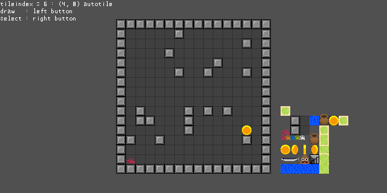

E512W3Dで使用できるタイルマップ機能です  

----

example  
  
<https://ebicochineal.github.io/E512W3D/emscripten-e512w3d-exampletm/>  
windows向けに画面サイズや入力を調整してるので他のプラットフォームで動かすにはコードを少し変更する必要があります  

----
texture  
  

----
#### Object2D
- 2Dワールド座標に描画できる2Dのオブジェクトです  
- カメラは3Dと同じE512W3DWindowのカメラを使います  
#### E512W3DGameObject2D
- Object2Dを継承した2Dのゲームオブジェクトでタイルマップや同クラスとの衝突判定などが行えます  
- 1フレームにどれだけ動くかを設定しmoveX, moveYで1軸ごとに移動させることができます。
- moveX, moveYで動かす限り、同じ当たり判定レイヤのオブジェクトやタイルとは、重なりや、すり抜けは発生しません  
- uint16_t collision_layer = 1 規定値で0b1です。各ビットを立てることで衝突するレイヤを設定できます  
- シューティングの自機や弾は衝突判定レイヤを使用せずにobjectAABBで衝突判定してください  
#### E512W3DTileMap
- 扱えるマップの大きさは縦*幅でuint32_tの最大値までです  
- 登録できるタイル（マップチップ）は1024つでそのうち0は無を表します。1~1023が設定し使用できるタイルです  
- getTileIndex(x, y) 指定座標にタイルのインデックスを取得  
- setTileIndex(x, y, t) 指定座標にタイルのインデックスを設定  
- getTileIndexS(x, y) 指定座標にタイルのインデックスを取得 範囲外の座標なら0  
- setTileIndexS(x, y, t) 指定座標にタイルのインデックスを設定 範囲外の座標なら設定しない  
#### E512W3DTile
- タイルマップに設定できるタイルです  
- レイヤAとオブジェクト層のレイヤBを持ちます  
- collision_layerも設定できます
#### E512W3DTileLayer
- タイルのグラフィックの座標やオートタイル、アニメーションなど設定できます  
- start_hはレイヤBオブジェクト層で使用します。2Dオブジェクトがタイルの座標より何ピクセル高ければこのレイヤBより奥に表示されるかを設定できます。また-1000などに設定すればどのオブジェクトよりも手前に表示する事もできます  
- レイヤBはtex_hを設定すれば大きなオブジェクトを表示する事ができます。  
- オートタイルを設定した場合、隣接する同タイルは繋がります  
  異なるタイルを繋げるにはautotile_plugとautotile_jackの各ビットを立てて設定してください  

